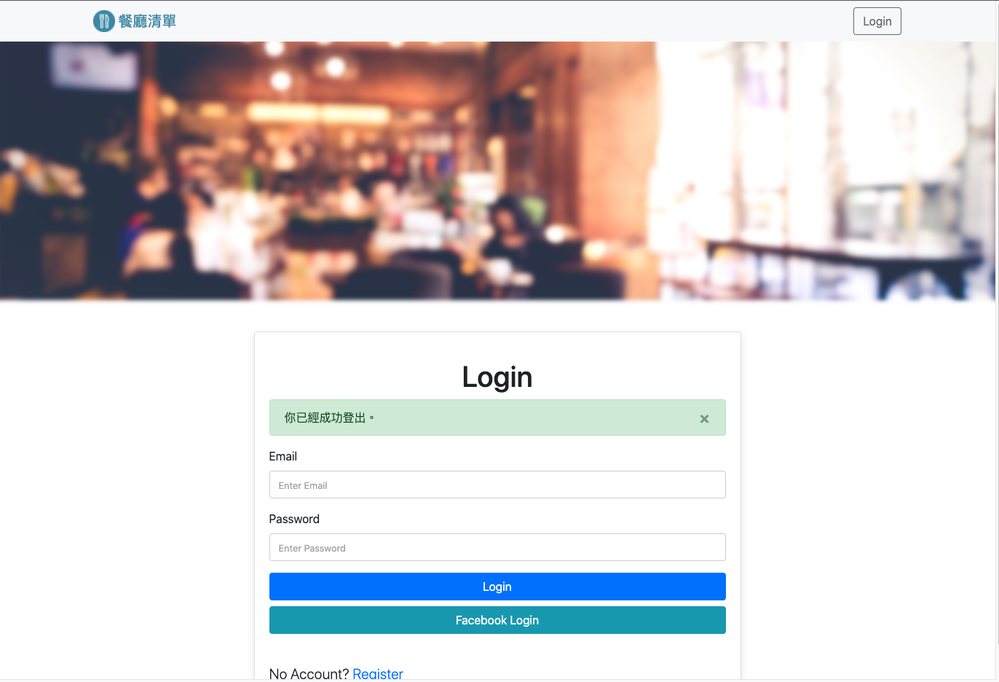
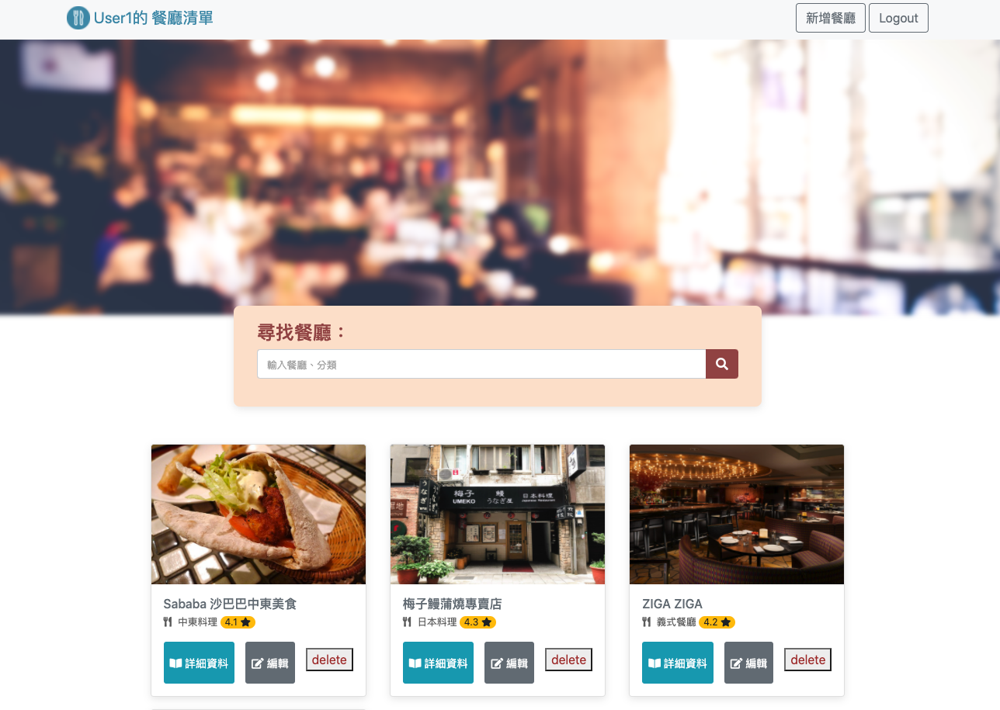

# 我的餐廳清單

使用Express.js, mongoDB 的餐廳清單網站。

## Features
1. 使用者可以建立帳號密碼登入(本地註冊 or FaceBook註冊)
2. 使用者可以在首頁查看所有餐廳的簡易資料
3. 使用者可以點擊有興趣的餐廳，並獲得更詳細的資訊
 `詳細資訊`包含：
  * 餐廳類型
  * 地址
  * 電話
  * 餐廳簡述
4. 使用者可以新增一家餐廳
5. 使用者可以修改一家餐廳的資訊
6. 使用者可以刪除一家餐廳
7. 使用者可以建立自己專屬的餐廳清單

## 預設使用者 Seed Users
>* email: user1@example.com
>* password: 12345678
>* email: user2@example.com
>* password: 12345678

## Installation

- 1.打開你的 terminal，Clone 此專案至本機電腦
  `git clone https://github.com/paulchnag0801/ResturantListA3 `
- 2.開啟終端機(Terminal)，進入存放此專案的資料夾
  `cd RestaurantListA3`
- 3.安裝 npm 套件
  `在 Terminal 輸入 npm install 指令`
- 4.安裝 nodemon 套件
  `在 Terminal 輸入 npm install -g nodemon`
- 5.設定環境變數檔案
  `將檔案 .env.example 檔名改為 .env。`
- 6.在終端機輸入以下指令新增種子資料
  `npm run seed`
- 7.啟動伺服器，執行 app.js 檔案
  `在 Terminal 輸入 npm run dev`
- 9.當 terminal 出現以下字樣，表示伺服器與資料庫已啟動並成功連結
  `Express is listening on localhost:3000`
  `mongodb connected!`
- 10.使用Facebook註冊登入
  `需要先在 [Facebook for Developers](https://developers.facebook.com/) 中建立應用程式，將應用程式編號和密鑰填入 .env，即可使用 facebook login 功能。`
- 11.關閉伺服器，結束專案
  `在終端機按下 `ctrl` + `c` 或 `cmd` + `c`，以關閉伺服器`

現在，你可開啟任一瀏覽器瀏覽器輸入 'http://localhost:3000' 開始使用我的餐廳清單嘍！

## Prerequisites

- 1.Visual Studio Code
- 2.Express 4.17.1
- 3.Node.js
- 4.BootStrap v4.3
- 5.JQuery v3.3.1
- 6.popper.js
- 7.restaurant.json
- 8.express-handlebars 5.3.2
- 9.mongoose 5.13.2
- 10.Mongo-Shell 4.2.6(需安裝Mongo-DB)
- 11.Robo 3T 1.4.3 (安裝Robo 3T觀看後端資料庫伺服器)

